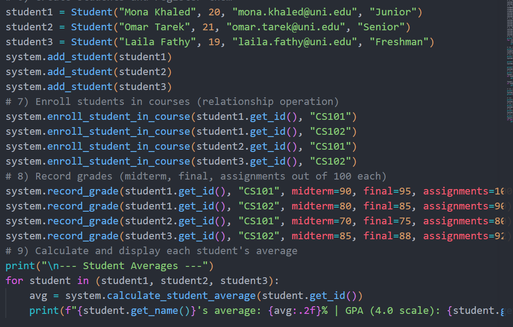

# 🎓 University Management System

## 📌 Project Overview

The **University Management System** is a Python-based Object-Oriented Programming (OOP) project designed to manage the main entities and operations inside a university.

The system allows users to manage:

* Students
* Instructors
* Departments
* Courses
* Enrollments
* Grades

The project also supports searching, updating, removing, assigning instructors, enrolling students, recording grades, calculating student averages, and handling invalid operations.

The project is implemented using **Python, OOP, Modules, and Imports** without using databases, web frameworks, APIs, GUIs, or external libraries.

---

# 🎯 Project Objectives

The main objectives of this project are to practice:

* Object-Oriented Programming (OOP)
* Classes and Objects
* Constructors
* Inheritance
* Object Relationships
* Encapsulation
* Methods
* Python Modules and Imports
* Multi-file Project Organization
* Basic Validation

---

# 🏗️ Project Structure

```text
University_Management_System/
│
├── images/
│   ├── sample_input.png
│   └── sample_output.png
│
├── models.py
├── courses.py
├── enrollment.py
├── university.py
├── main.py
└── README.md
```

---

# 📂 Modules Description

## 🔹 `models.py`

Contains the core person-related classes:

* `Person`
* `Student`
* `Instructor`

### Person

The base class that contains common information shared between people in the university.

Example attributes:

* ID
* Name
* Age
* Email

### Student

Inherits from `Person`.

A student can:

* Enroll in courses
* Store enrollment information
* Remove enrollment from a course

### Instructor

Inherits from `Person`.

An instructor can:

* Be assigned to courses
* Store assigned courses
* Have a specialization

---

## 🔹 `courses.py`

Contains:

* `Department`
* `Course`

### Department

Represents a university department.

A department contains:

* Department ID
* Department Name
* Courses
* Instructors

### Course

Represents a university course.

A course contains:

* Course Code
* Title
* Credit Hours
* Department
* Instructor
* Enrolled Students

---

## 🔹 `enrollment.py`

Contains:

* `Enrollment`
* `Grade`

### Enrollment

Represents the relationship between a student and a course.

### Grade

Represents the grade received by a student in a specific course.

---

## 🔹 `university.py`

Contains the central system class:

### UniversitySystem

This class manages all objects and coordinates the main operations of the system.

It manages:

* Students
* Instructors
* Departments
* Courses
* Enrollments
* Grades

---

## 🔹 `main.py`

The main demonstration file.

It:

* Imports classes from different modules
* Creates predefined objects
* Adds objects to the system
* Performs several operations
* Displays meaningful results
* Tests validation cases

No class implementations are written inside `main.py`.

---

# 👥 Classes

| Class              | Description                             |
| ------------------ | --------------------------------------- |
| `Person`           | Base class for people in the university |
| `Student`          | Represents a university student         |
| `Instructor`       | Represents a university instructor      |
| `Department`       | Represents a university department      |
| `Course`           | Represents a university course          |
| `Enrollment`       | Connects a student with a course        |
| `Grade`            | Stores a student's grade in a course    |
| `UniversitySystem` | Central manager of the system           |

---

# 🔗 Object Relationships

The system contains multiple relationships between objects.

### Student and Course

A student can enroll in one or more courses through the `Enrollment` class.

```text
Student
   │
   │ enrolls through
   ▼
Enrollment
   │
   ▼
Course
```

### Instructor and Course

An instructor can be assigned to one or more courses.

```text
Instructor
   │
   │ teaches
   ▼
Course
```

### Course and Department

Each course belongs to a department.

```text
Department
   │
   ▼
Course
```

### Grade Relationship

A grade is connected to both a student and a course.

```text
Grade
 ├── Student
 │
 └── Course
```

---

# 🧬 Inheritance

The project uses inheritance as follows:

```text
          Person
         /      \
        /        \
   Student    Instructor
```

Both `Student` and `Instructor` inherit common attributes and behavior from the `Person` class.

---

# ⚙️ System Features

## ➕ Create / Register

The system allows:

* Adding students
* Adding instructors
* Adding departments
* Adding courses

---

## 📄 Display

The system can display:

* Student information
* Student courses
* Course students
* Course information
* Department information

---

## 🔍 Search

The system supports:

* Searching for a student
* Searching for a course

---

## ✏️ Update

Student information can be updated, including:

* Name
* Email
* Major

---

## 🗑️ Remove

The system supports:

* Removing a student from a course
* Removing a course

---

## 🔗 Relationship Operations

The system allows:

* Enrolling students in courses
* Removing students from courses
* Assigning instructors to courses
* Adding grades to students

---

## 🧮 Calculation

The system calculates the student's average grade based on course credit hours.

---

## 🛡️ Validation

The system handles invalid cases such as:

* Adding duplicate objects
* Adding the same course twice to a department
* Adding the same student twice to a course
* Enrolling a student in a non-existing course
* Enrolling a non-existing student
* Enrolling the same student twice
* Adding a grade to a student who is not enrolled
* Adding a grade outside the range of `0 - 100`
* Removing a student who is not enrolled in a course

---

# ▶️ How to Run the Project

Make sure Python is installed on your computer.

Open the project folder and run:

```bash
python main.py
```

The program will automatically create predefined objects and demonstrate the functionality of the system.

> ⚠️ The project does not use `input()`. All objects and operations are predefined inside `main.py`.

---

# 📥 Sample Predefined Data

Since the project does not use `input()`, all students, instructors, departments, and courses are predefined inside `main.py`.

The following screenshot shows examples of the predefined objects and operations.

<!-- Add your main.py screenshot here -->



---

# 📤 Sample Output

After running:

```bash
python main.py
```

The program displays the results of the different operations.

The following screenshot shows the program output.

<!-- Add your terminal output screenshot here -->


---

# 🖥️ Example Output

```text
============================================================

1. CREATE DEPARTMENT

Department Computer Science added successfully.

============================================================

2. CREATE STUDENTS

Student Ahmed Ali added successfully.
Student Sara Mohamed added successfully.
Student Omar Hassan added successfully.

============================================================

3. CREATE INSTRUCTORS

Instructor Dr. Mona added successfully.
Instructor Dr. Khaled added successfully.

============================================================

4. CREATE COURSES

Course Python OOP added successfully.
Course Database Systems added successfully.

============================================================

5. ASSIGN INSTRUCTORS

Dr. Mona assigned to Python OOP.
Dr. Khaled assigned to Database Systems.

============================================================

6. ENROLL STUDENTS

Ahmed Ali enrolled in Python OOP.
Ahmed Ali enrolled in Database Systems.
Sara Mohamed enrolled in Python OOP.

============================================================

8. CALCULATE STUDENT AVERAGES

Ahmed Ali's average: 87.50
Sara Mohamed's average: 91.50

============================================================

15. VALIDATION CASES

Trying to enroll in a non-existing course:

Invalid enrollment: course does not exist.

Trying to enroll the same student twice:

Student is already enrolled in this course.

DEMONSTRATION FINISHED
```

---

# 🧠 OOP Concepts Used

## Classes and Objects

Each real-world entity in the university is represented by a class.

Examples:

* Student
* Instructor
* Course
* Department

---

## Constructors

Each class uses the `__init__()` method to initialize object attributes.

Example:

```python
def __init__(self, name, age):
    self.name = name
    self.age = age
```

---

## Inheritance

`Student` and `Instructor` inherit from the `Person` class.

This allows the child classes to reuse common attributes and methods.

---

## Object Relationships

Classes interact with each other through relationships.

Examples:

* Student → Course
* Instructor → Course
* Course → Department
* Grade → Student and Course

---

## Encapsulation

Each class manages its data and behavior using its own attributes and methods.

Examples:

* `add_student()`
* `remove_student()`
* `assign_instructor()`
* `add_course()`

---

## Modules and Imports

The project is divided into multiple Python files to improve:

* Organization
* Readability
* Maintainability

Classes are imported where needed.

Example:

```python
from models import Student, Instructor
from courses import Course, Department
from university import UniversitySystem
```

---

# 🚫 Restrictions Followed

The project does **NOT** use:

* `input()`
* Database
* SQL
* Flask
* Django
* APIs
* GUI
* Web Development
* Authentication Systems
* External Libraries

The project uses only:

```text
Python + OOP + Modules + Imports
```

---

# 👩‍💻 Team Members

| Team Member | Responsibility                                   |
| ----------- | ------------------------------------------------ |
| Member 1    | Person, Student, and Instructor classes          |
| Member 2    | Department and Course classes                    |
| Member 3    | Enrollment, Grade, and UniversitySystem logic    |
| Member 4    | Integration, Testing, main.py, and Documentation |

> Replace the member names and responsibilities with the actual team information before submitting the project.

---

# 📚 Conclusion

The **University Management System** is a simple multi-file Python project that demonstrates the practical use of Object-Oriented Programming.

The project applies important OOP concepts such as:

* Classes and Objects
* Constructors
* Inheritance
* Object Relationships
* Encapsulation
* Methods
* Modules and Imports

It also demonstrates how multiple classes can work together to build a complete university management system.
